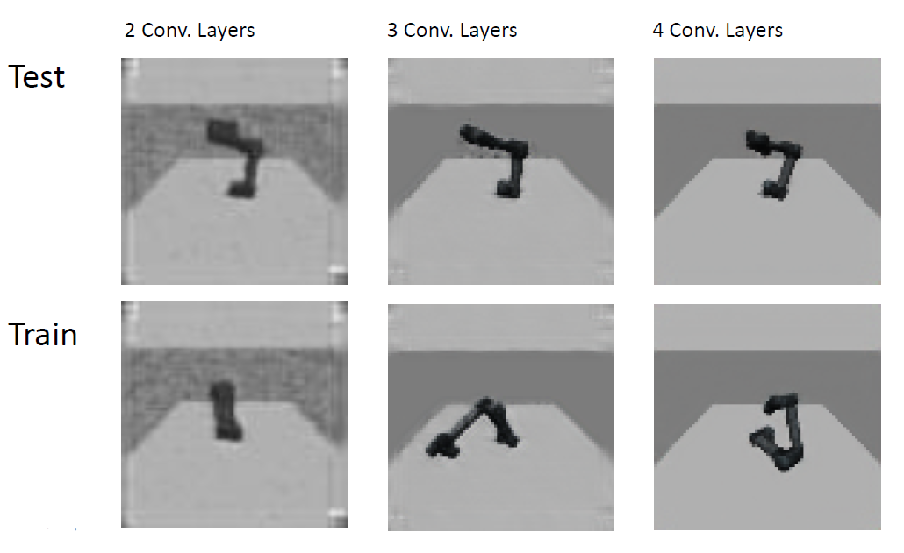

# Rauschunterdrückung mittels Convolutional Autoencoder (CNN)

Dieses Projekt befasst sich mit der Eliminierung von Bildrauschen in Roboter-Szenen (RobotMNIST) unter Verwendung von Deep Learning. Ziel ist es, verrauschte Eingabebilder durch ein Encoder-Decoder-Netzwerk zu rekonstruieren.

  
   
  <em>Vergleich der Rekonstruktionsqualität bei 2, 3 und 4 Convolutional Layers.</em>

## Methodik & Architektur
Das Modell basiert auf einem **Convolutional Autoencoder**, der in PyTorch implementiert wurde. Der Encoder reduziert die Dimensionalität zur Feature-Extraktion, während der Decoder über Transposed Convolutions das Bild wiederherstellt.

  

- **Framework:** PyTorch.
- **Experimente:** Vergleich von drei Modellvarianten (2, 3 und 4 Schichten).
- **Aktivierungsfunktionen:** Evaluation von ReLU, Sigmoid und Tanh. Die besten Ergebnisse wurden durch die Kombination von **ReLU** (Hidden Layers) und **Sigmoid** (Output Layer) erzielt.

## Datensatz & Vorverarbeitung
Als Datensatz wurde **RobotMNIST** verwendet. Die Originalbilder wurden auf 79x79 Pixel skaliert und mit künstlichem Rauschen versehen, um das Modell zu trainieren.

  
  
   
  <em>Links: Originalbild (Target) | Rechts: Verrauschtes Bild (Input).</em>

## Trainingsverlauf & Ergebnisse
Die Analyse der Lernkurven zeigt eine stabile Konvergenz. Mit zunehmender Netzwerktiefe konnte der Mean Squared Error (MSE) signifikant gesenkt werden.

  
  

## Projektstruktur
- `main.py`: Zentrales Skript für das Training, die Validierung und Visualisierung.
- `/model`: Definition der Denoising-Modelle (`autoencoder.py`).
- `/utils`: Skripte zur Datenaufbereitung und zum Laden des Datensatzes (`dataset.py`).
- `/Images`: Beispieldaten, Architektur-Diagramme und grafische Auswertungen.

## Voraussetzungen
- Python 3.x
- PyTorch / Torchvision
- Matplotlib, NumPy
